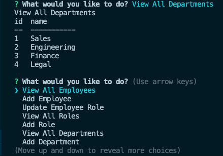
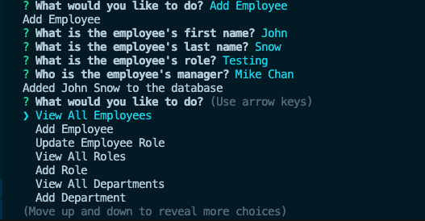
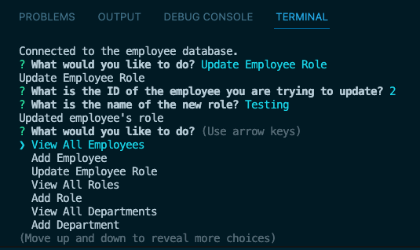

# THE Database to Track Your Employees

## Description

I was motivated to create this Command Line application with Node.JS to further my knowledge and become more comfortable with working in the command line with Node. I built this app as a very intuitive and easy way to keep track of employees and departments within a company. The code within the app updates the tables as new data is entered or removed. It makes keeping track of an organization a lot easier and more efficient. I got to work with MySQL2 a ton and make my own queries in order for the tables to talk to each other and that was a big learning experience for me.

## Installation

The steps to install my project are as follows:

- Clone or fork my code from GitHub
- Install the required dependencies (Inquirer, Console.Table, MySQL2)
- Source the Schema.sql file and then the Seeds.sql file
- Run the file from the command line using "npm start"

## Usage

Here is a link to a video of the file running:

[Video Link](https://drive.google.com/file/d/1LwpK3Sfv1GN_VAtm6_8U5egM6DkrSfC5/view)

Here is an example of viewing all departments in the app:

Here is an example of adding a new employee in the app:

Here is an example of updating an employee role in the app:

## License

MIT License

Copyright (c) 2023 Erich Z.

Permission is hereby granted, free of charge, to any person obtaining a copy of this software and associated documentation files (the "Software"), to deal in the Software without restriction, including without limitation the rights to use, copy, modify, merge, publish, distribute, sublicense, and/or sell copies of the Software, and to permit persons to whom the Software is furnished to do so, subject to the following conditions:

The above copyright notice and this permission notice shall be included in all copies or substantial portions of the Software.

THE SOFTWARE IS PROVIDED "AS IS", WITHOUT WARRANTY OF ANY KIND, EXPRESS OR IMPLIED, INCLUDING BUT NOT LIMITED TO THE WARRANTIES OF MERCHANTABILITY, FITNESS FOR A PARTICULAR PURPOSE AND NONINFRINGEMENT. IN NO EVENT SHALL THE AUTHORS OR COPYRIGHT HOLDERS BE LIABLE FOR ANY CLAIM, DAMAGES OR OTHER LIABILITY, WHETHER IN AN ACTION OF CONTRACT, TORT OR OTHERWISE, ARISING FROM, OUT OF OR IN CONNECTION WITH THE SOFTWARE OR THE USE OR OTHER DEALINGS IN THE SOFTWARE.

